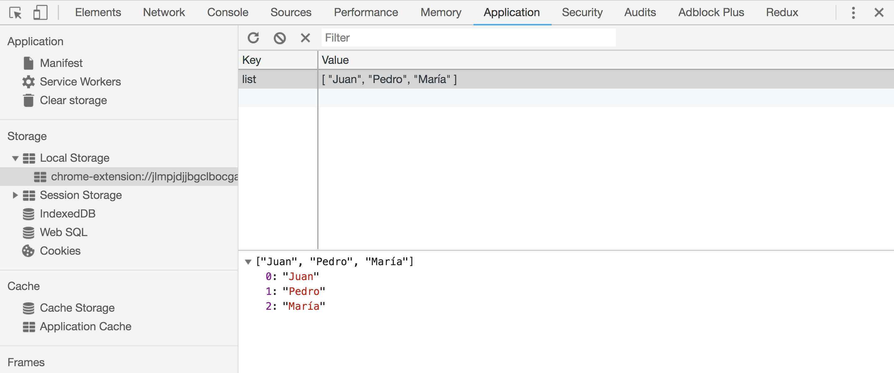

# SessionStorage

- El sessionStorage es un objeto global que tiene el navegador y que nos va a permitir persistir información durante la sesión que el usuario tenga en la página. La sesión va a durar hasta que el usuario cierre la pestaña o el navegador, cuando lo haga eso va a borrar la información guardada en este objeto. El espacio de almacenamiento es de aproximadamente 2.5 MB a 5 MB depende del navegador que estemos usando y actualmente esta ampliamente soportado. Este objeto suele ser un buen reemplazo de la Cookies para algunos de sus casos de uso, como también para almacenar datos como el Token de acceso o configuraciones del usuario. Al igual que un objeto la forma de ordenar los datos es con un par `key: value`, solo que en este caso el `value` se guarda siempre en formato `string`.

# LocalStorage

- El localStorage es un objeto global que tiene el navegador con las mismas características que tiene el SessionStorage, la única diferencia es que su tiempo de duración es ilimitado por lo cual la información se mantiene guardada aun cuando se cierre el navegador o la pestaña.

## Verlo en las devTools

- El sessionStorage y el localStorgae puede verse en las devTools de Chorme en la solapa `Application` como muestra la siguiente foto



> Acá podemos ver los valores que ya tiene cargados así como los nuevos que vayamos agregando, pisando o eliminando.

## Métodos

- Tanto el SessionStorage como LocalStorage tiene los mismos métodos principales.

### SetItem

- El método `setItem(key, value)` recibe como parámetro una key y un valor y como resultado guarda el valor en la key pasada como parámetro, si ya existe un valor lo pisa.

```js
var list = '[ "Juan", "Pedro", "María" ]'

sessionStorage.setItem('list', list)

localStorage.setItem('list', list)
```

> El primer método guarda en el sessionStorage el JSON que representa un Array de nombres en la key `list`, el segundo método hace lo mismo pero en el localStorage.

### GetItem

- El método `getItem(key)` recibe como parámetro una key y devuelve el valor almacenado en esa key, en caso de que no exista devuelve `null`

```js
var list = localStorage.getItem('list')

console.log(list) // Muestra en consola el JSON que guardamos anteriormente '[ "Juan", "Pedro", "María" ]'
```

> Usamos el método getItem para recuperar el valor guardado en el localStorage, bajo la key `list`.

### RemoveItem

- El método `removeItem(key)` recibe como parámetro una key y elimina el valor almacenado en esa así como la key.

```js
localStorage.removeItem('list')
```

> Usamos el método removeItem para eliminar tanto la key como el valor que guardamos anteriormente.