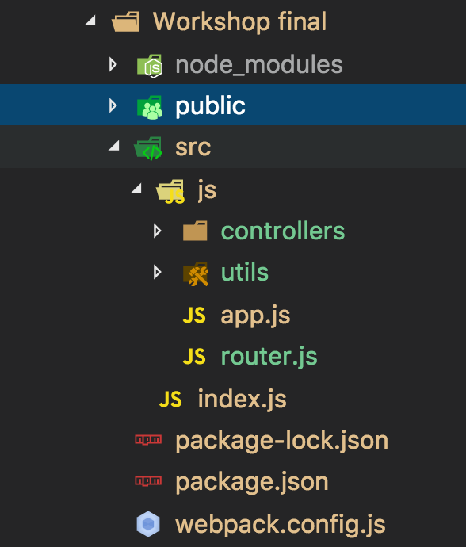

# Router de una SPA

El Router en una SPA nos permite ejecutar nuestro código en respuesta a cambios en la URL, de esta manera podemos cambiar el contenido cuando cambia la URL y de esa manera simular la navegación entre distintas páginas de la App sin que el usuario vuelva a recargar. Por ejemplo si el usuario navega de `/home` -> `/contact` nosotros cargamos el HTML del formulario de contacto y su JavaScript asociado en nuestro contenedor principal pero sin movernos del `index.html`. Esto vuelve a la página mucho más rápida, le da una mejor experiencia al usuario y nos permite construir aplicaciones más complejas.

## Crossroads

Crossroads que es una biblioteca de JavaScript que nos permite ir ejecutando código a medida que cambias las rutas en la URL de nuestra página.

[Página oficial](https://millermedeiros.github.io/crossroads.js/)

Para empezar utilizarlo vamos a crear un archivo `router.js` en la misma carpeta que esta nuestro `app.js`.



Dentro de `app.js` al comienzo del archivo vamos a agregar la siguiente línea de código:

```js
import './router'
```

> Esto va a incluir todo lo que escribamos en `router.js` en nuestra App.

Luego dentro de `router.js` empezamos a definir nuestro Router agregando el siguiente código:


```js
import crossroads from 'crossroads'

crossroads.addRoute('/', function () {
  console.log('Home page')
})

// En cada cambio del # va a verificar las rutas
$(window).on('hashchange', function () {
  crossroads.parse(window.location.hash)
})

crossroads.parse(window.location.hash)
```

> Este código va a mostrar en consola `Home page` cuando este en la ruta principal de la App.

Si queremos agregar nuevas rutas a nuestra App simplemente agregamos llamamos al `addRoute`:

```js
crossroads.addRoute('#/contact', function () {
  console.log('Contact page')
})
```

> Este código muestra en consola `Contact page` cuando estoy en la ruta `#/contact`


